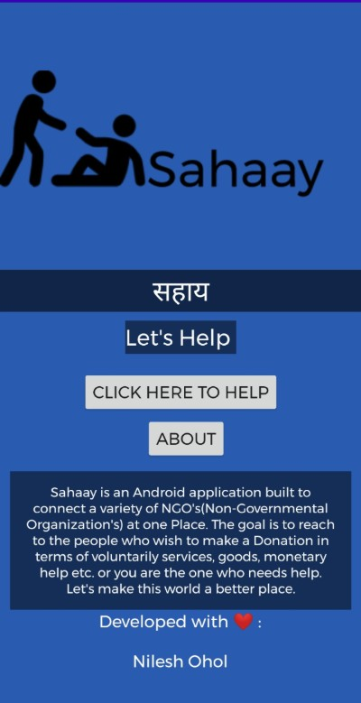

# Sahaay 🤝🌏
## Sahaay is an Android application built to connect a variety of NGO's(Non-Governmental Organization's) at one Place. 
## The goal is to reach to the people who wish to make a Donation in terms of voluntarily services, goods, monetary help etc. or you are the one who needs help.
## Let's make this world a better place. 

## 🎞 Video Demo:<a href = "https://drive.google.com/file/d/18J3NSxefszoN0ynm6p_Vhx7TmcZnFxpS/view?usp=sharing">Click Here</a>
## 📱 Apk File: <a href="https://drive.google.com/file/d/1C8wsXm4mpQpecbKmqED_l5Vmxyh6ifRG/view?usp=sharing">Click Here</a>

# Main Page:

